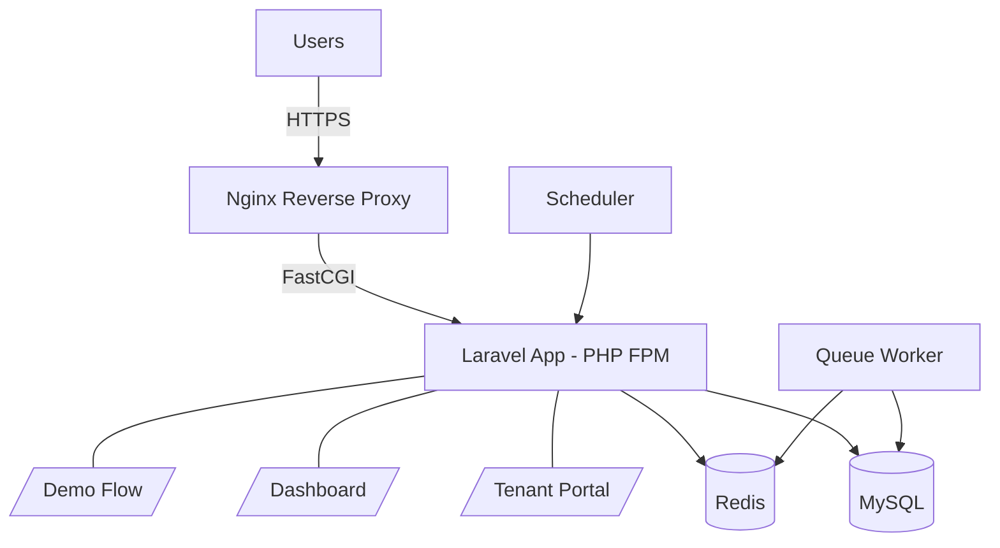

# 🏢 Immobile

[](https://github.com/PayamAbdolmohammadi/immobile/actions/workflows/ci.yml)
[](https://immobilen.payamdev.de)
[](https://opensource.org/licenses/MIT)


Production-ready **SaaS platform** for managing **German-style rental and property operations** — including tenants, leases, billing, operating cost settlements, bank matching, and tenant-facing workflows.

Built with a modern full-stack architecture using:

* **Laravel 13 (PHP 8.3)**
* **MySQL / SQLite**
* **Vite + Tailwind CSS + Alpine.js**
* **Docker + Nginx**
* **AWS EC2 + Let’s Encrypt SSL**

👉 Default locale and UI language: **German (`de_DE`)**

---

# 🚀 Core Features

| Area                     | Description                                                                                                    |
| ------------------------ | -------------------------------------------------------------------------------------------------------------- |
| **Portfolio Management** | Manage tenants (`Mieter`), properties (`Objekte`), units (`Einheiten`), and rental agreements (`Mietverträge`) |
| **Billing Engine**       | Automated monthly rent generation, invoices, reminders (`Mahnung`), cancellations (`Storno`)                   |
| **Operating Costs**      | Full **Nebenkostenabrechnung (NK)** workflow with PDF export                                                   |
| **Bank Integration**     | CSV import + transaction matching to invoices and tenants                                                      |
| **Accounting Export**    | Simple CSV + **DATEV-ready export**                                                                            |
| **Tenant Portal**        | Dedicated `/portal` area with login, dashboard, and document access                                            |
| **Demo Flow**            | Guided landlord demo under `/demo-flow`                                                                        |
| **Onboarding**           | Mandatory mandant setup before accessing the full system                                                       |

---

# 🧠 Product Vision

> **„Die Miete läuft automatisch.“**

Immobile transforms rental contracts into an automated billing and property workflow platform for landlords and property managers.

---

# 🔐 Authentication

* Staff authentication via **Laravel Breeze**
* Email verification required
* Separate tenant portal guard (`mieter`)

---

# 📦 Tech Stack

| Layer    | Technology                     |
| -------- | ------------------------------ |
| Backend  | Laravel 13 (PHP 8.3)           |
| Frontend | Blade, Tailwind CSS, Alpine.js |
| Database | MySQL / SQLite                 |
| PDF      | barryvdh/laravel-dompdf        |
| DevOps   | Docker, Nginx                  |
| Hosting  | AWS EC2                        |
| SSL      | Let’s Encrypt                  |

---

# ⚙️ Requirements

* PHP ^8.3
* Composer 2.x
* Node.js + npm
* MySQL / SQLite

---

# ⚡ Quick Start

```bash
git clone git@github.com:PayamAbdolmohammadi/immobilen.git
cd immobilen

composer run setup
composer run dev
```

Open:

```txt
http://127.0.0.1:8000
```

---

# 🛠 Manual Setup

```bash
composer install
cp .env.example .env

php artisan key:generate

touch database/database.sqlite

php artisan migrate

npm install
npm run dev

php artisan serve
```

---

# 🐳 Docker (Production)

Start the production stack:

```bash
docker compose up -d --build
```

Production URL:

```txt
https://immobilen.payamdev.de
```

---

# 🧪 Demo Data

Seed demo data:

```bash
php artisan db:seed
```

Demo credentials:

```txt
Email: demo@example.com
Password: password
```

---

# 🔗 Important Routes

| Route                | Purpose              |
| -------------------- | -------------------- |
| `/`                  | Landing page         |
| `/dashboard`         | Main application     |
| `/portal/login`      | Tenant portal        |
| `/demo-flow`         | Guided product demo  |
| `/contracts/{token}` | Public contract page |

---

# 🧪 Testing

```bash
composer test
```

Runs Laravel tests after clearing config cache.

---

# 📁 Project Structure

```txt
app/
├── Http/Controllers
├── Domain/

resources/views/
routes/web.php
database/
docs/
```

---

# 🏗 Architecture (Production)



---

# ☁️ Deployment

The application is deployed in a production environment using:

* AWS EC2
* Docker containers
* Nginx reverse proxy
* Let’s Encrypt SSL
* Custom domain via IONOS DNS

---

# ⚙️ Configuration Notes

* Timezone: `Europe/Berlin`
* Queue / Cache: database driver
* Mail driver: `log` (development only)

---

# 📚 Documentation

* `docs/PHASE_2_TECHNIK_CHECKLISTE.md`

---

# 🧾 License

MIT License (Laravel + project code).

Third-party packages retain their respective licenses.

---

# 👨‍💻 Author

**Payam Abdolmohammadi**
Full-Stack Software Engineer
Laravel • SaaS • APIs • AWS • Docker
